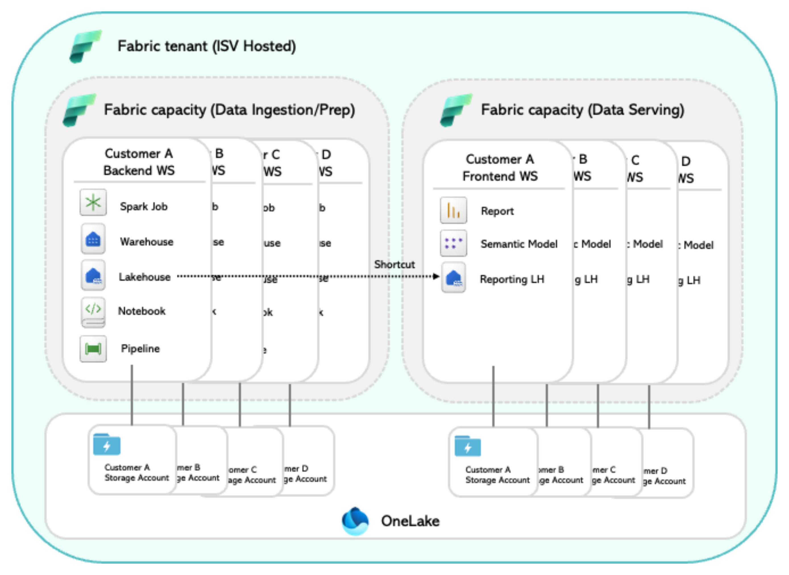
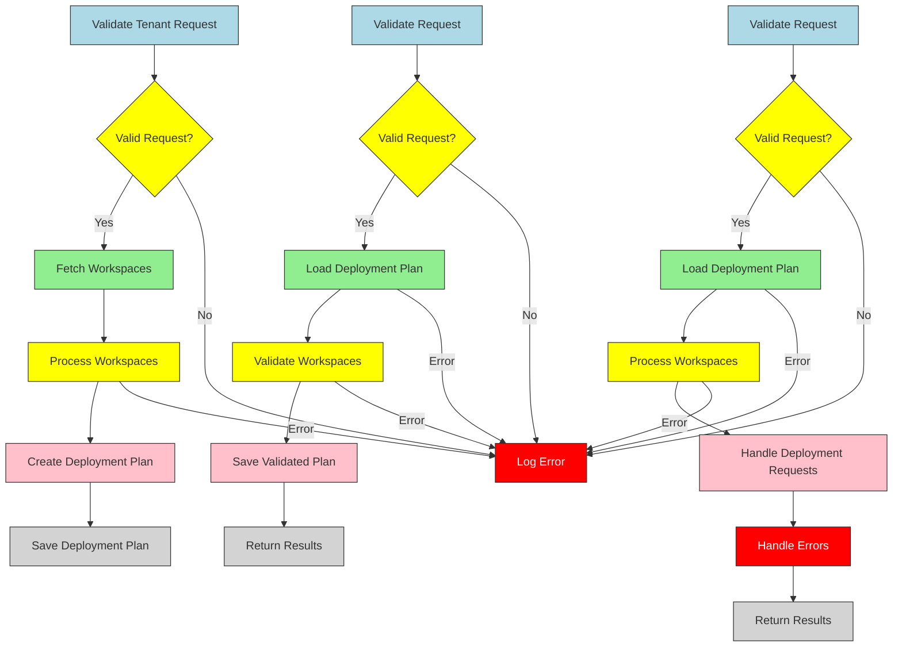

# Fabric Deployment Hub

## Overview

The **Fabric Deployment Hub** is a .NET tool designed for managing deployment planning and execution in Microsoft Fabric. Hosted on Azure Container Apps (ACA), it provides APIs for scalable, multi-workspace deployments, making it ideal for CI/CD integrations and large-scale environments.

A non simple topology will include multiple workspaces and capacities as described below:



---

## Why

Microsoft Fabric environments often involve complex deployment scenarios across multiple workspaces. This project simplifies and automates these deployments, addressing challenges such as:
- **Scalability**: Handles deployments across hundreds or thousands of workspaces efficiently.
- **CI/CD Integration**: Seamlessly integrates with existing CI/CD pipelines.
- **Flexibility**: Supports dynamic configurations to adapt to varying deployment requirements.

---

## What

Here is a very high level diagram of the Fabric Deployment Hub together with the fabric tenant:


This tool provides:

- **REST APIs** for managing deployments programmatically.
- **Containerized Environment** for easy scalability and deployment.
- **Dynamic Configuration Management** to streamline multi-tenant deployments.
- **Azure Managed Identity Integration** for secure authentication and access control.

### Additional Resources

For a detailed explanation of the **guiding principles** and **design guidelines** used in the Fabric Deployment Hub, refer to the [Design Principles](./design-principles.md) document.

---

### Key Features

- **Scalable Deployments**: Handles large-scale deployment needs.
- **Customizable Configurations**: Uses `appsettings.json` for tenant-specific setups.
- **Secure Authentication**: Integrates with Azure Managed Identities for secure and compliant operations.


---

## How




### Deployment Planning

The **Fabric Deployment Planning Process** ensures that resources within a tenant are evaluated and prepared for deployment. It follows a structured approach to validate configurations, resolve dependencies, and create deployment plans while minimizing the impact of errors.

#### Steps in the Planning Process

1. **Validate Tenant Request**  
   The process begins by validating the tenant deployment request. Validation errors are logged as issues, and further processing halts for invalid requests.

2. **Fetch Workspaces**  
   All workspaces within the tenant are retrieved to determine the deployment scope. This step uses an authenticated API call to the Fabric API.

3. **Process Each Workspace**  
   For each workspace:
   - **Validate Configuration**: Ensure the workspace configuration is valid and complete. Any issues are logged, and invalid workspaces are excluded from planning.
   - **Evaluate Items**: Process individual items (e.g., notebooks, files) within the workspace:
     - **Read Metadata**: Extract metadata to understand item details and requirements.
     - **Resolve Dependencies**: Identify and resolve dependencies, such as Lakehouse and Environment. Missing or unresolved dependencies are logged as issues, and the respective item is skipped.
     - **Replace Placeholders**: Update item content with resolved values (e.g., settings, variables).
     - **Inject Metadata**: Update the item with resolved dependencies and metadata.
   - **Create Deployment Requests**: For items that pass validation, create deployment requests to include them in the workspace's deployment plan.

4. **Generate Deployment Plan**  
   A deployment plan is created for each valid workspace. It includes:
   - Eligible items that passed validation.
   - Detailed logs of issues encountered during processing.

5. **Save Deployment Plan**  
   The deployment plan is saved to a designated storage location for validation and execution.

---
### Validate Deployment Plan

The **Fabric Deployment Plan Validation Process** ensures that all items and workspaces defined in a deployment plan are valid, and prepares the plan for execution by identifying necessary updates, creations, or issues.

---

#### Steps in the Validation Process

1. **Validate the Request**  
   - Check that the request contains the required fields: `PlanFile` and `RepoContainer`.
   - If any of these fields are missing or invalid, log a warning and return an error response.

2. **Load the Deployment Plan**  
   - Fetch the deployment plan from the specified blob storage container.
   - If the plan cannot be found or loaded, log an appropriate error and return an error response.

3. **Validate Workspaces and Deployment Requests**  
   For each workspace in the deployment plan:
   - **Fetch Workspace Items**: Retrieve existing items from the workspace using the Fabric API.
   - **Validate Each Deployment Request**:
     - Compare the `DisplayName` of the deployment request with existing workspace items.
     - If the item exists, mark the deployment request as an **Update** and copy the existing item's ID.
     - If the item does not exist, mark the deployment request as a **Create** and set the ID to empty.
     - If an error occurs while fetching workspace items, mark all deployment requests for the workspace as **Error** and log the issue.

4. **Save the Validated Plan**  
   - Save the validated deployment plan back to the blob storage container with a filename prefixed by `validated-`.
   - If the save operation fails, log the error and return a failure response.

5. **Return Validation Results**  
   - On successful validation, return a response containing the validated plan's filename and storage container.
   - If any issues occur during the validation process, ensure they are logged and surfaced for review.

---
### Deploy a Plan

The **Fabric Deployment Process** enables the execution of a validated deployment plan, ensuring all items and workspaces are deployed efficiently and correctly. This process handles individual deployment requests and gracefully manages errors to prevent the failure of unrelated deployments.

---

#### Steps in the Deployment Process

1. **Validate the Deployment Request**  
   - Ensure the request includes the required fields: `PlanFile` and `RepoContainer`.
   - Log and reject requests with missing or invalid fields.

2. **Load the Deployment Plan**  
   - Retrieve the deployment plan from blob storage.
   - Validate the structure and content of the plan. If errors are found or the JSON structure is invalid:
     - Return a detailed error response, including issues in the plan.

3. **Process Each Workspace in the Plan**  
   For each workspace:
   - Log the start of deployment processing.
   - Iterate through each deployment request in the workspace.

4. **Handle Deployment Requests**  
   For each deployment request:
   - **Validate the Request**: Ensure required fields such as `DisplayName` and `TargetWorkspaceId` are present.
   - **Determine the Action**:
     - If the request is marked as `Create`, handle it via the `HandleCreateRequestAsync` method.
     - If the request is marked as `Update`, handle it via the `HandleUpdateRequestAsync` method.
     - If the request has an unsupported validation status, log the issue and skip the deployment.
   - **Send the Request**: Use the appropriate API calls to execute the deployment action.

5. **Handle Errors**  
   - If a deployment request encounters an error, it is logged, and the specific deployment is skipped:
     - **HTTP Errors**: Log and capture the details of HTTP-related issues.
     - **Timeouts**: Capture and log timeout errors during the request.
     - **Unexpected Errors**: Log and capture any unhandled exceptions.
   - Errors for specific deployment requests are returned in the response for review.

6. **Return Deployment Results**  
   - If all deployment requests are successful, return a success response.
   - If any errors occur, return a response with status `207` (Multi-Status) to indicate partial success, along with details of the errors.

---

### Error Handling

The **Fabric Deployment Hub** ensures robust error handling across all stages of the process: planning, validation, and deployment. Errors are managed at multiple levels to isolate issues and allow other parts of the process to proceed independently.

#### Levels of Error Handling

- **Request-Level Errors**  
  - If a tenant request is invalid (e.g., missing required fields or containing malformed data), the process halts immediately with a detailed error response.
  - Example: Missing `PlanFile` or `RepoContainer`.

- **Plan-Level Errors**  
  - Invalid or unprocessable deployment plans are rejected with detailed error messages during both validation and deployment phases.
  - Example: Deployment plans with structural issues or unresolvable dependencies are logged and returned for review.

- **Workspace-Level Errors**  
  - Errors in one workspace do not impact the processing of other workspaces.
  - Example: If items cannot be fetched or dependencies cannot be resolved for a workspace, that workspace's deployment is skipped, while others proceed.

- **Item-Level Errors**  
  - Issues for specific items are logged, and the affected items are skipped without halting the process.
  - Example: Missing metadata, unresolved dependencies, or API failures for individual items.

---

### Key Benefits

The **Fabric Deployment Hub** provides few advantages during planning, validation, and deployment:

- **Fault-Tolerant Execution**  
  - Ensures that issues in one workspace or item do not disrupt the overall process.
  - Granular error handling isolates problems at the item, workspace, and plan levels.

- **Granular Validation and Deployment**  
  - Each deployment request is validated and processed independently, ensuring resilience and minimizing cascading failures.

- **Detailed Logging**  
  - Comprehensive logs track issues and actions taken during planning, validation, and deployment phases, aiding in troubleshooting and transparency.

- **Customizable Actions**  
  - Supports operations like `Create` and `Update` with extensibility for new item types, making the system adaptable to changing needs.

- **Transparent and Actionable Results**  
  - Provides clear and actionable outcomes for each phase, including detailed reports of errors, successful deployments, and skipped items.

---

### Prerequisites

- .NET 8.0 SDK
- Docker (for local containerization)
- Azure Subscription with Container Apps enabled
- Configuration values for:
  - `FABRIC_TENANT_CONFIG`
  - `AZURE_TENANT_ID`
  - `FABRIC_API_CLIENT_ID`
  - `FABRIC_API_CLIENT_SECRET`

### Installation

1. Clone the repository:
   ```bash
   git clone https://github.com/your-repository/fabric-deployment-hub.git
2.	Navigate to the project directory:
    ```bash
    cd fabric-deployment-hub
    ```
3. Restore dependencies and build the project:
    ```bash
    dotnet restore
    dotnet build
    ```
### Running Locally

1. Update appsettings.json with your configuration values.
2. Start the application: `dotnet run`
3. Access the APIs at http://localhost:5000.

### Containerization

1. Build the Docker image: `docker build -t fabric-deployment-hub .`
2. Run the container: `docker run -p 5000:80 fabric-deployment-hub`

### Deployment to Azure Container Apps

1. Ensure containerapp-config.json is configured for your environment.
2. Deploy the app using Azure CLI: `az containerapp up --source . --name fabric-deployment-hub --resource-group <your-resource-group>`

## License

This project is licensed under the terms of the MIT License.