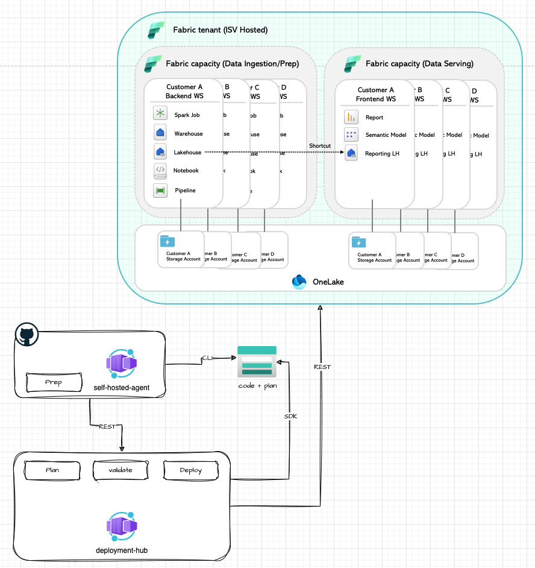
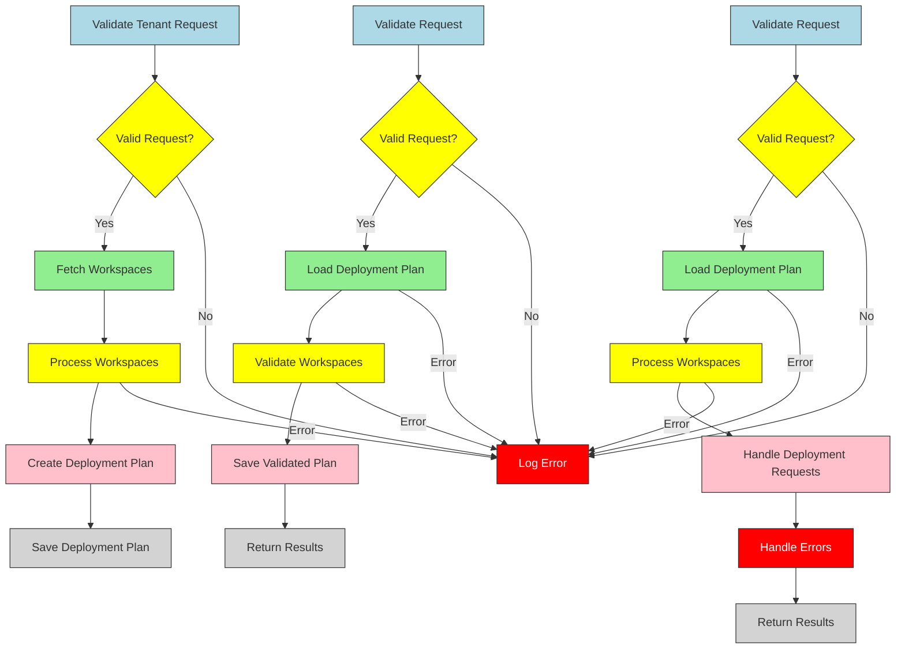

# Fabric Deployment Hub

## Overview

The **Fabric Deployment Hub** is a .NET tool designed for managing deployment planning and execution in Microsoft Fabric. Hosted on Azure Container Apps (ACA), it provides APIs for scalable, multi-workspace deployments, making it ideal for CI/CD integrations and large-scale environments.

---

## Why

Microsoft Fabric environments often involve complex deployment scenarios across multiple workspaces. This project simplifies and automates these deployments, addressing challenges such as:
- **Scalability**: Handles deployments across hundreds or thousands of workspaces efficiently.
- **CI/CD Integration**: Seamlessly integrates with existing CI/CD pipelines.
- **Flexibility**: Supports dynamic configurations to adapt to varying deployment requirements.

---

## What

Here is a very high level diagram of the Fabric Deployment Hub together with a non simple fabric tenant topology with multiple workspaces and capacities:



This tool provides:

- **REST APIs** for managing deployments programmatically.
- **Containerized Environment** for easy scalability and deployment.
- **Dynamic Configuration Management** to streamline multi-tenant deployments.
- **Azure Managed Identity Integration** for secure authentication and access control.

The security angle is detailed in [network-security-design](./network-security-design.md)

### Additional Resources

For a detailed explanation of the **guiding principles** and **design guidelines** used in the Fabric Deployment Hub, refer to the [Design Principles](./design-principles.md) document.

---

### Key Features

- **Scalable Deployments**: Handles large-scale deployment needs.
- **Customizable Configurations**: Uses `appsettings.json` for tenant-specific setups.
- **Secure Authentication**: Integrates with Azure Managed Identities for secure and compliant operations.


---

## How

Below is a **Mermaid** diagram illustrating the main workflows.



### Overview

The Fabric Deployment Hub streamlines tenant resource deployment by providing a fault-tolerant, multi-phase approach:

1. **Deployment Planning**:  
   - Validates the tenant request.
   - Fetches and processes workspaces.
   - Resolves dependencies and creates a deployment plan.

2. **Validate Deployment Plan**:  
   - Loads and verifies the deployment plan.
   - Checks each workspace and its items, marking them as create, update, or error.

3. **Deploy a Plan**:  
   - Executes each valid deployment request.
   - Logs or skips errors without halting the entire process.

4. **Error Handling**:  
   - Errors are isolated by item, workspace, or overall plan, ensuring partial failures don’t halt the entire deployment.

5. **Key Benefits**:  
   - **Fault-Tolerant Execution**: Issues in one workspace/item don’t disrupt others.  
   - **Granular Validation & Deployment**: Each request is validated independently.  
   - **Detailed Logging**: Comprehensive logs for each phase.  
   - **Customizable Actions**: Supports create, update, or more advanced operations.  
   - **Actionable Results**: Returns clear outcomes for each phase, including detailed errors.

>Note: For more detailed information about each phase, see [detailed-deployment-phases](detailed-deployment-phases.md).

---

### Prerequisites

- .NET 8.0 SDK
- Docker (for local containerization)
- Azure Subscription with Container Apps enabled
- Configuration values for:
  - `FABRIC_TENANT_CONFIG`
  - `AZURE_TENANT_ID`
  - `FABRIC_API_CLIENT_ID`
  - `FABRIC_API_CLIENT_SECRET`

### Installation

1. Clone the repository:
   ```bash
   git clone https://github.com/your-repository/fabric-deployment-hub.git
2.	Navigate to the project directory:
    ```bash
    cd fabric-deployment-hub
    ```
3. Restore dependencies and build the project:
    ```bash
    dotnet restore
    dotnet build
    ```
### Running Locally

1. Update appsettings.json with your configuration values.
2. Start the application: `dotnet run`
3. Access the APIs at http://localhost:5000.

### Containerization

1. Build the Docker image: `docker build -t fabric-deployment-hub .`
2. Run the container: `docker run -p 5000:80 fabric-deployment-hub`

### Deployment to Azure Container Apps

1. Ensure containerapp-config.json is configured for your environment.
2. Deploy the app using Azure CLI: `az containerapp up --source . --name fabric-deployment-hub --resource-group <your-resource-group>`

## License

This project is licensed under the terms of the MIT License.