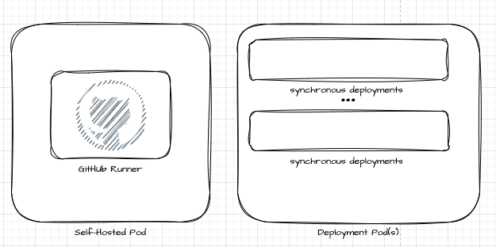

# Fabric Deployment Hub

## Overview

The **Fabric Deployment Hub** is a .NET tool designed for managing deployment planning and execution in Microsoft Fabric. Hosted on Azure Container Apps (ACA), it provides APIs for scalable, multi-workspace deployments, making it ideal for CI/CD integrations and large-scale environments.

---

## Why

Microsoft Fabric environments often involve complex deployment scenarios across multiple workspaces. This project simplifies and automates these deployments, addressing challenges such as:
- **Scalability**: Handles deployments across hundreds or thousands of workspaces efficiently.
- **CI/CD Integration**: Seamlessly integrates with existing CI/CD pipelines.
- **Flexibility**: Supports dynamic configurations to adapt to varying deployment requirements.

---

## What

This tool provides:

- **REST APIs** for managing deployments programmatically.
- **Containerized Environment** for easy scalability and deployment.
- **Dynamic Configuration Management** to streamline multi-tenant deployments.
- **Azure Managed Identity Integration** for secure authentication and access control.

### Key Features

- **Scalable Deployments**: Handles large-scale deployment needs.
- **Customizable Configurations**: Uses `appsettings.json` for tenant-specific setups.
- **Secure Authentication**: Integrates with Azure Managed Identities for secure and compliant operations.


---

## How

### Prerequisites

- .NET 8.0 SDK
- Docker (for local containerization)
- Azure Subscription with Container Apps enabled
- Configuration values for:
  - `FABRIC_TENANT_CONFIG`
  - `AZURE_TENANT_ID`
  - `FABRIC_API_CLIENT_ID`
  - `FABRIC_API_CLIENT_SECRET`

### Installation

1. Clone the repository:
   ```bash
   git clone https://github.com/your-repository/fabric-deployment-hub.git
2.	Navigate to the project directory:
    ```bash
    cd fabric-deployment-hub
    ```
3. Restore dependencies and build the project:
    ```bash
    dotnet restore
    dotnet build
    ```
### Running Locally

1. Update appsettings.json with your configuration values.
2. Start the application: `dotnet run`
3. Access the APIs at http://localhost:5000.

### Containerization

1. Build the Docker image: `docker build -t fabric-deployment-hub .`
2. Run the container: `docker run -p 5000:80 fabric-deployment-hub`

### Deployment to Azure Container Apps

1. Ensure containerapp-config.json is configured for your environment.
2. Deploy the app using Azure CLI: `az containerapp up --source . --name fabric-deployment-hub --resource-group <your-resource-group>`

## License

This project is licensed under the terms of the MIT License.